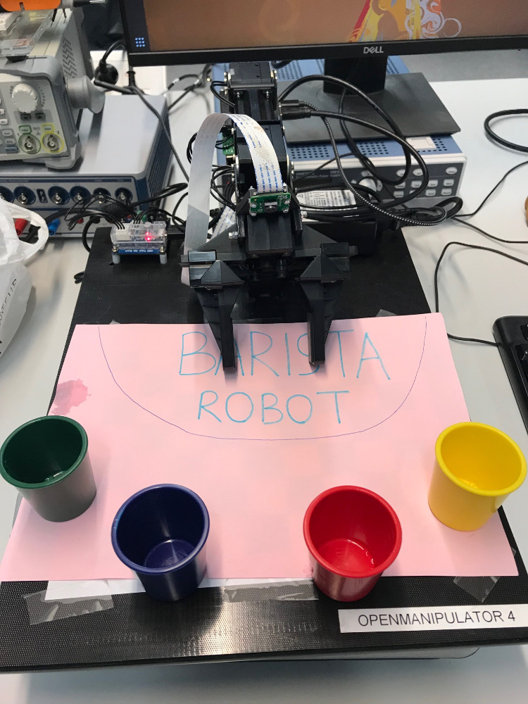

Robot Barista
==========

Le bras robot OpenManipulator et la PiCamera sont utilisés pour faire un petit robot Barista.
* Le fichier **controleur.py** contient le programme principal avec une interface de sélection de cocktails depuis la console. 
* Le fichier **fct_couleurs.py** contient les fonctions associées à la caméra, pour faire notamment de la détection de gobelets (contours fermés d'une certaine couleur). 
* Le fichier **move_robot.py** contient la commande de déplacement du robot avec notamment des fonctions pour ouvrir/fermer la pince, déplacer le robot vers une position absolue ou faire des déplacements relatifs.

.. note::

Le code source est disponible sur notre page GitHub et il devrait être suffisamment commenté pour une compréhension globale de son fonctionnement en complément de cette documentation.

