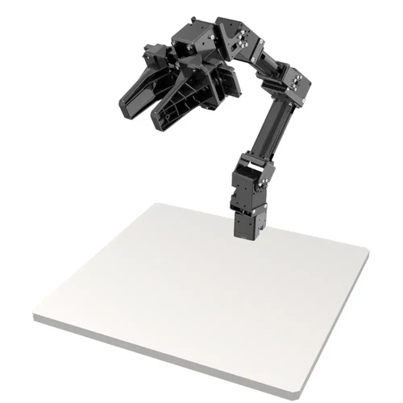

Documentation OpenManipulator Barista
=====================================

Cette documentation explique comment installer et utiliser un OpenManipulator. Utilisé pour notre projet en 5ème année de mécatronique à l'INSA de Strasbourg, le but est de le tourner en petit robot barista pour servir des cocktails à partir de plusieurs recettes.

   Openmanipulator et son espace de travail

.. toctree::
   :maxdepth: 2
   :caption: Tables des matières
   
   intro
   configuration
   utilisation