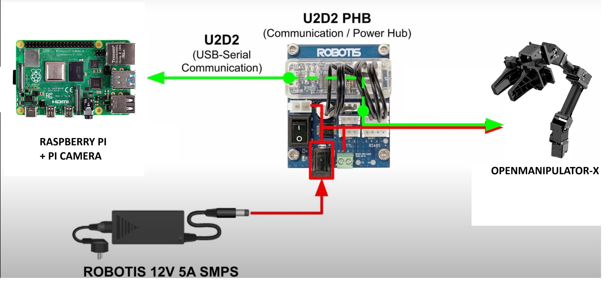

Introduction
============

OpenManipulator est un bras robotique développé par ROBOTIS. La documentation officielle  du robot est disponible sur `<https://emanual.robotis.com/docs/en/platform/openmanipulator_x/overview/>`_.

Matériels nécessaires
=====================

Pour ce projet, nous avons utilisé les éléments suivants :

   Setup pour le contrôle de l'OpenManipulator

